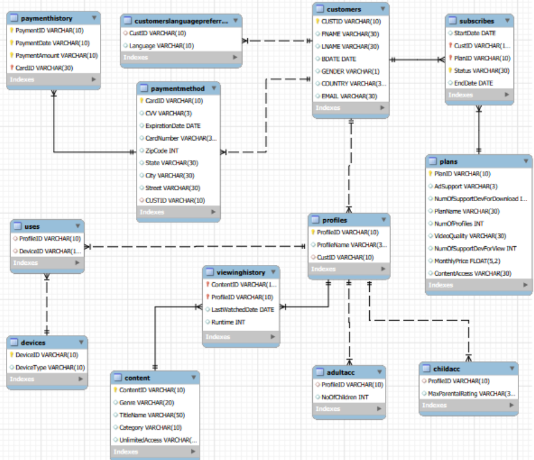

# 🎬 Netflix Database Management System


---

## 📌 Project Overview

Designed and developed a relational database for a Netflix-style streaming platform using SQL. The project demonstrates relational database design, normalization, table relationships, and SQL operations to manage users, movies, TV shows, subscriptions, ratings, and watch history efficiently.

---

## 🎯 Project Objectives

- Design a normalized relational database
- Manage users and subscription plans
- Store information about movies and TV shows
- Track user ratings and watch history
- Practice SQL DDL and DML operations
- Implement relationships using primary and foreign keys

---

## 🛠 Technologies Used

- SQL
- MySQL
- Relational Database Management System (RDBMS)

---

## 🗄 Database Tables

- Users
- Movies
- TV Shows
- Genres
- Subscriptions
- Ratings
- Watch History

---

## 📚 SQL Concepts Covered

- CREATE TABLE
- INSERT INTO
- UPDATE
- DELETE
- ALTER TABLE
- PRIMARY KEY
- FOREIGN KEY
- Constraints
- INNER JOIN
- LEFT JOIN
- RIGHT JOIN
- Aggregate Functions
- GROUP BY
- ORDER BY
- Normalization

---

## 📷 Database Preview

### Entity Relationship (ER) Diagram



---

## 📂 Folder Structure

```text
07-SQL-Netflix-Database
│
├── README.md
├── LICENSE
│
├── SQL
│   └── netflix_database.sql
│
└── Images
    └── ER-Diagram.png
```

---

## 💡 Key Learning Outcomes

- Designed a normalized relational database for a streaming platform.
- Established relationships between multiple entities using primary and foreign keys.
- Applied SQL best practices for data integrity and consistency.
- Strengthened database design and SQL programming skills.

---

## 👨‍💻 Author

**Shivam Choudhry**
